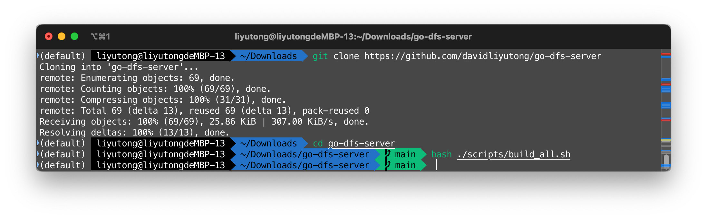
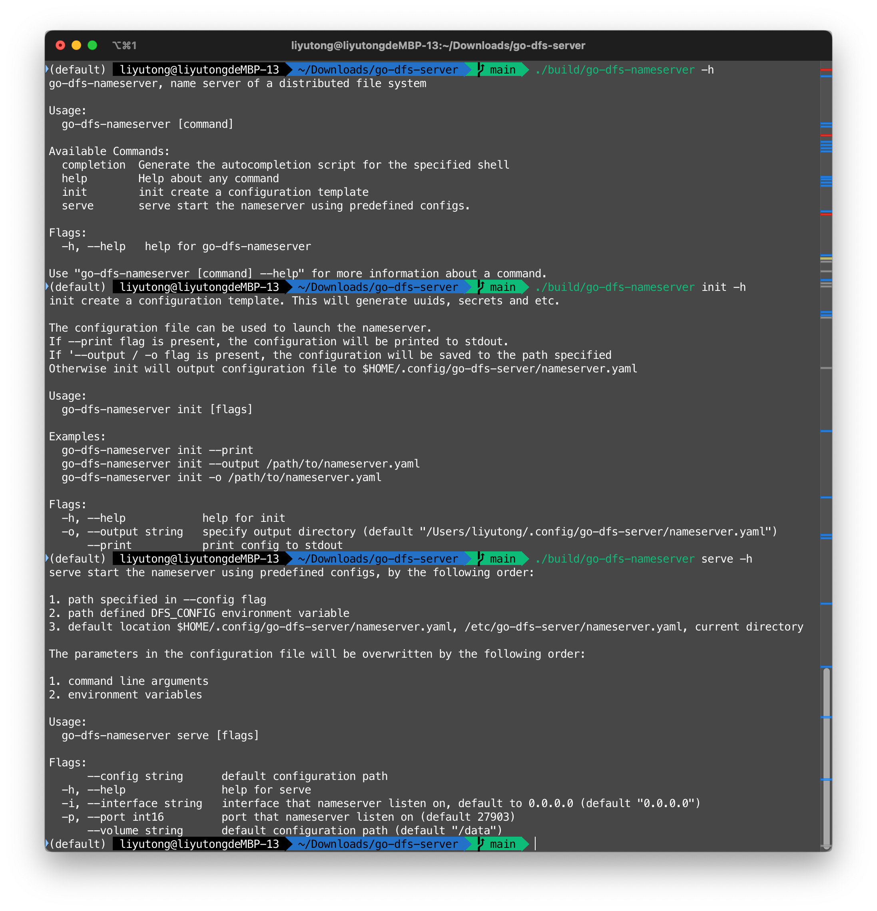
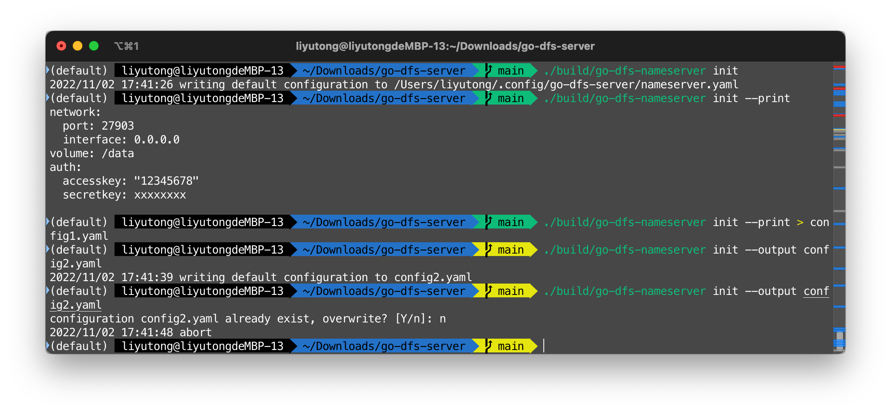
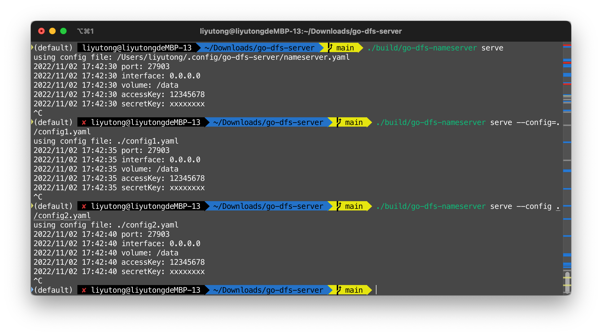
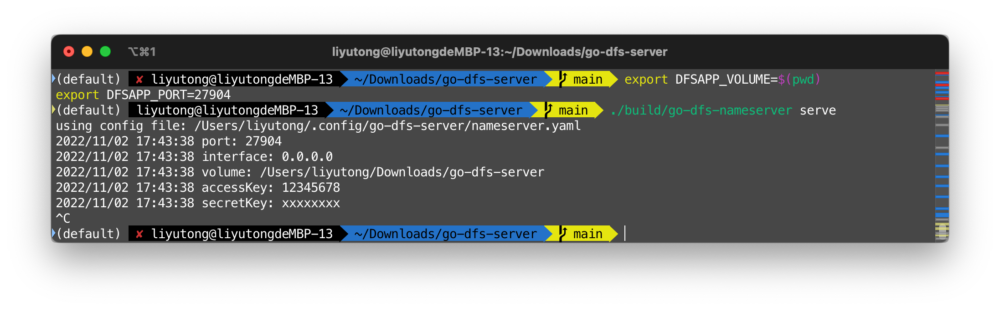
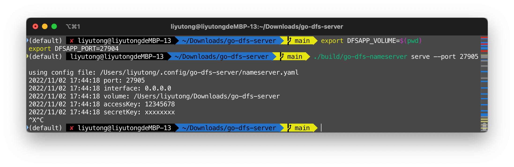

# Cobra / Viper / PFlags 使用

## 概述

`Cobra` 提供了一种快速设计命令行应用的范式。使用`Cobra`后，编程人员不需要手动解析命令行参数来确定需要执行的功能。

`Viper` 为Golang程序提供了一种解析配置文件的框架。它被设计为支持从多种常见的配置来源解析配置

`Pflags` 是一种处理命令行参数的工具，使用该工具可以简化命令行参数读取，自动处理错误的输入

## 设计思路

### Cobra 和 PFlags

若要设计一个命令行程序，首先需要定义该程序的主要功能。例如某分布式文件系统服务`go-dfs-nameserver`有`serve`，`init`两个功能，其中而`init`生成默认配置文件并保存到指定位置，`serve`读取配置文件启动一个进程对外提供服务。

`Cobra`使用`cobra.Command`来描述命令行应用的功能这种情况下，我们可以创建两个对应的`initCmd`和`serveCmd`

```go
package cmd

import (
    "github.com/spf13/cobra"
    "go-dfs-server/pkg/nameserver"
    "go-dfs-server/pkg/nameserver/config"
)

var rootCmd = &cobra.Command{
    Use:   "go-dfs-nameserver",
    Short: "go-dfs-nameserver, name server of a distributed file system",
    Long:  "go-dfs-nameserver, name server of a distributed file system",
}

var serveCmd = &cobra.Command{
    Use: "serve",
    SuggestFor: []string{
        "ru", "ser",
    },
    Short: "serve start the nameserver using predefined configs.",
    Long: `serve start the nameserver using predefined configs, by the following order:

1. path specified in --config flag
2. path defined DFS_CONFIG environment variable
3. default location $HOME/.config/go-dfs-server/nameserver.yaml, /etc/go-dfs-server/nameserver.yaml, current directory

The parameters in the configuration file will be overwritten by the following order:

1. command line arguments
2. environment variables
`,
    Run: nameserver.MainLoop,
}

var initCmd = &cobra.Command{
    Use: "init",
    SuggestFor: []string{
        "ini",
    },
    Short: "init create a configuration template",
    Long: `init create a configuration template. This will generate uuids, secrets and etc. 

The configuration file can be used to launch the nameserver.
If --print flag is present, the configuration will be printed to stdout.
If '--output / -o flag is present, the configuration will be saved to the path specified
Otherwise init will output configuration file to $HOME/.config/go-dfs-server/nameserver.yaml
`,
    Example: `  go-dfs-nameserver init --print
  go-dfs-nameserver init --output /path/to/nameserver.yaml
  go-dfs-nameserver init -o /path/to/nameserver.yaml`,
    Run: config.Init,
}

```

利用`Cobra`提供的特性，我们可以轻松根据构想来将命令和对应的函数绑定，这里列举了一些假象用例：

- `go-dfs-nameserver init --print` 将默认配置输出到终端，可以被重定向到文件
- `go-dfs-nameserver init --output ./config.yaml` 将默认配置输出到文件，`--output`可以简化为`-o`
- `go-dfs-nameserver serve` 从默认的目录读取配置文件
- `go-dfs-nameserver serve --config /path/to/config` 从给定的目录读取配置文件

注意到，上述的代码块没有注册设置对命令行参数的解析，也没有将`initCmd`、`serveCmd`和`rootCmd`建立联系：我们通常使用一个独立的函数来将他们组织起来。

```go
package cmd

func getRootCmd() *cobra.Command {
    
    serveCmd.Flags().String("config", "", "default configuration path")
    serveCmd.Flags().Int16P("port", "p", config.NameserverDefaultPort, "port that nameserver listen on")
    serveCmd.Flags().StringP("interface", "i", config.NameserverDefaultInterface, "interface that nameserver listen on, default to 0.0.0.0")
    serveCmd.Flags().String("volume", config.NameserverDefaultVolume, "default configuration path")
    rootCmd.AddCommand(serveCmd)

    initCmd.Flags().Bool("print", false, "print config to stdout")
    initCmd.Flags().StringP("output", "o", config.NameserverDefaultConfig, "specify output directory")
    rootCmd.AddCommand(initCmd)

    return rootCmd
}
```

该函数将`initCmd`、`serveCmd`添加到`rootCmd`下，并且为他们注册诸如`config`，`port`之类的参数。我们可以看到，**PFlags和Cobra的使用是耦合的，他们都是处理命令行参数的工具。其中，PFlags依附于Cobra，设计程序时应该先确定Cobra命令结构，再决定每个命令关联的PFlags**

我们可以用定义在cmd包下的`Execute()`函数来调用`getRootCmd()`以得到`rootCmd`并执行之

```go
package cmd

func Execute() {
    rootCmd := getRootCmd()
    if err := rootCmd.Execute(); err != nil {
        panic(err)
    }
}

```

此时main包成为了单纯的程序入口：

```go
package main

import (
    "go-dfs-server/pkg/nameserver/cmd"
)

func main() {
    cmd.Execute()
}

```

## PFlags 解析

`cobra.Command.Run`记录的是与该Command绑定的函数，它具有`func (*cobra.Command, []string)`的签名，实现了该Command的特定功能。其第一个形参为Command本身，第二个形参为Cobra解析完flags后剩余的命令行参数。

在函数内，我们可以使用`cmd.Flags()`获取PFlags解析出的参数：

```go
package config

func Init(cmd *cobra.Command, args []string) {
    printFlag, _ := cmd.Flags().GetBool("print")
    outputPath, _ := cmd.Flags().GetString("output")
    ...
}
```

### Viper 使用

Viper的使用相对独立于和Cobra，这里给出一些常见的使用场景

#### 创建一个独立的Viper Config

```go
package config

vipCfg := viper.New()
```

#### 设定Viper Config的默认值

```go
package config

vipCfg.SetDefault("network.port", NameserverDefaultPort)
vipCfg.SetDefault("network.interface", NameserverDefaultInterface)
vipCfg.SetDefault("volume", NameserverDefaultVolume)
```

这里可以用`.`设置嵌套的配置

#### 从`--config`指定的文件读取配置

```go
package config

if configFileCmd, err := cmd.Flags().GetString("config"); err == nil && configFileCmd != "" {
    vipCfg.SetConfigFile(configFileCmd)
}

if err := vipCfg.ReadInConfig(); err == nil {
    fmt.Println("using config file:", vipCfg.ConfigFileUsed())
}
```

#### 从目录按照给定的格式搜索配置

```go
package config

vipCfg.SetConfigName(NameserverDefaultConfigName)
vipCfg.SetConfigType("yaml")
vipCfg.AddConfigPath(NameserverDefaultConfigSearchPath)
```

#### 从环境变量加载配置

```go
package config

vipCfg.SetEnvPrefix("DFSAPP")
vipCfg.AutomaticEnv()
```

例如`DFSAPP_VOLUME`参数将会替换`volume`选项的值，`DFSAPP_NETWORK.PORT`参数将会替换`network.port`选项的值

#### 将Viper Config导出到结构体

```go
package config

serverCfg := NameserverCfg{}
if err := vipCfg.Unmarshal(&serverCfg); err != nil {
    log.Panicln("failed to unmarshal config")
}

```

## 实验

[go-dfs-server](https://github.com/davidliyutong/go-dfs-server) 实现了上述的一个DFS应用（目前没有真正功能），可以用于验证解析配置模块的设计

### 下载源码

```shell
git clone https://github.com/davidliyutong/go-dfs-server
cd go-dfs-server
```

### 编译

使用项目附带的脚本编译，将在`build`目录下生成可执行文件

```shell
bash ./scripts/build_all.sh
```

或者使用`go build`命令

```shell
mkdir build
go build -o ./build/go-dfs-nameserver ./cmd/nameserver/app.go
go build -o ./build/go-dfs-dataserver ./cmd/dataserver/app.go
go build -o ./build/go-dfs-client ./cmd/client/app.go
```



### 运行程序

使用`-h`获取帮助

```shell
./build/go-dfs-nameserver -h
./build/go-dfs-nameserver init -h
./build/go-dfs-nameserver serve -h
```



使用`init`生成默认配置文件

```shell
./build/go-dfs-nameserver init # 将会生成~/.config/go-dfs-server/nameserver.yaml
./build/go-dfs-nameserver init --print # 将会输出到终端
./build/go-dfs-nameserver init --print > config1.yaml # 将会输出到config1.yaml
./build/go-dfs-nameserver init --output config2.yaml
./build/go-dfs-nameserver init --output config2.yaml #将会提示是否覆盖
```



使用`serve`读取配置启动服务

```shell
./build/go-dfs-nameserver serve # 将会寻找~/.config/go-dfs-server/nameserver.yaml
./build/go-dfs-nameserver serve --config=./config1.yaml
./build/go-dfs-nameserver serve --config ./config2.yaml
```



环境变量将会覆盖从文件读取的配置

```shell
export DFSAPP_VOLUME=$(pwd)
export DFSAPP_PORT=27904
./build/go-dfs-nameserver serve
```



命令行参数将会覆盖环境变量

```shell
export DFSAPP_VOLUME=$(pwd)
export DFSAPP_PORT=27904
./build/go-dfs-nameserver serve --port 27905
```


