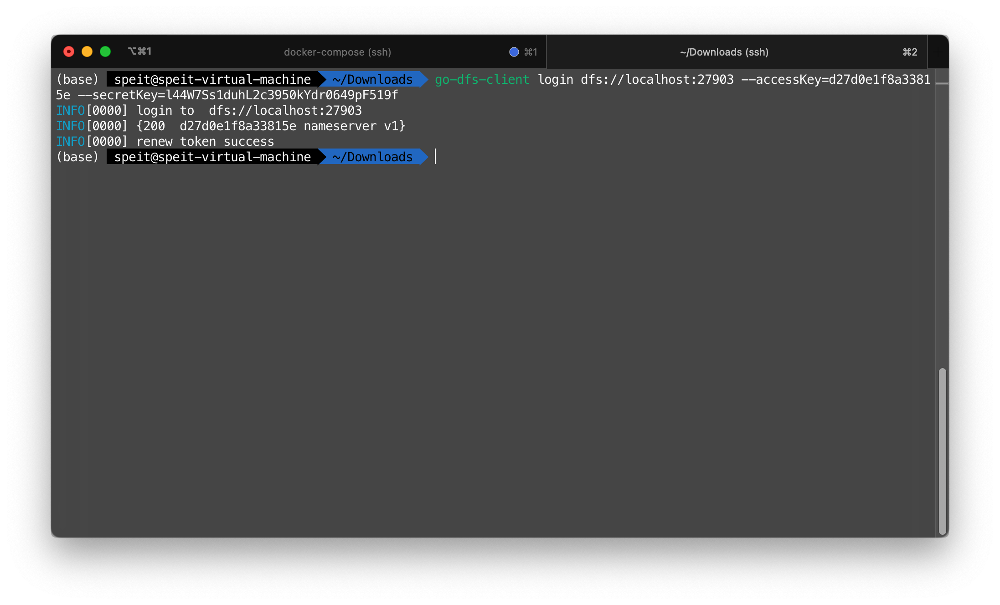

# 分布式文件系统 - 课程报告

厉宇桐 121260910046

## 简介

此次作业包括一套由数据节点和数据节点组成的分布式文件系统，以及一个独立的客户端用于操作该分布式文件系统。

## 系统概述

参照 HDFS，系统包括 NameServer 和 DataServer 两部分

-   DataServer: 无认证的数据服务器，Restful 设计。DataServer 可以对文件和目录增删查改，并对 Chunk 进行读写增减
-   NameServer: 带有 accessKey/secretKey 认证对服务器，Restful 设计。NameServer 可以读写文件的元数据`MetaData`和文件的数据`Data`

该文件系统使用 Golang 编写，自带客户端`go-dfs-client`可以从该分布式文件系统上传下载文件

每一台 DataServer 在启动时都会创建一个 UUID 用于标识自己，该 UUID 将会被持久化保存。NameServer 使用启动时传入的 DataServer 地址来联络 DataServer 们，并记录 DataServer 的 UUID，这一机制避免了 DataServer 替换后，NameServer 无法正确识别新 NameServer 的问题

## 文件如何分布

该文件系统中有两类对象

-   目录，以文件系统目录存在
-   文件，以文件系统目录存在，其目录下一定存在`meta.json`文件记录元数据。NameServer 只保存元素数据，其数据按照`<id>.dat`的名称分布在 DataServer 上

文件元数据定义如下：

```go
type BlobMetaData struct {
    Type              string     `json:"type"`
    BaseName          string     `json:"base_name"`
    Version           int64      `json:"version"`
    Size              int64      `json:"size"`
    Presence          []string   `json:"presence"`
    Versions          []int64    `json:"versions"`
    ChunkChecksums    [][]string `json:"chunk_checksums"`
    ChunkDistribution [][]string `json:"chunk_distribution"`
}
```

相关字段解释如下

-   `Type` 文件类型，可以是或者
-   `BaseName` 文件的名称
-   `Version` 文件当前的版本，元数据每次修改（例如文件的扩充和缩减）都会增加 1
-   `Size` 文件的大小，单位为字节
-   `Presence` 文件在哪些服务器上存在，内容为服务器的 UUID
-   `Versions` 文件每一个块的版本，每当一个块经历写入操作，该值都会增加 1
-   `ChunkChecksums` 文件每一个块的校验和
-   `ChunkDistribution` 文件每一个块的分布，，内容为服务器的 UUID

## 数据服务器 DataServer

数据服务器主要实现下列 API

| API                        | Parameters                            | Description                                              |
| -------------------------- | ------------------------------------- | -------------------------------------------------------- |
| `/ping`                    | -                                     | 心跳                                                     |
| `/v1/blob/createChunk`     | path, id                              | 创建文件块                                               |
| `/v1/blob/createFile`      | path                                  | 创建文件，初始化元数据                                   |
| `/v1/blob/createDirectory` | path                                  | 创建目录                                                 |
| `/v1/blob/deleteChunk`     | path, id                              | 删除文件块                                               |
| `/v1/blob/deleteFile`      | path                                  | 删除文件                                                 |
| `/v1/blob/deleteDirectory` | path                                  | 删除目录                                                 |
| `/v1/blob/readChunk`       | path, id, offset, size                | 读取一个文件特定块的特定偏移的固定长度的内容             |
| `/v1/blob/readFileMeta`    | path                                  | 读取一个文件的元数据                                     |
| `/v1/blob/readChunkMeta`   | path, id                              | 读取文件块的校验和                                       |
| `/v1/blob/writeChunk`      | path, id, offset, size, version, data | 向一个文件特定块的特定偏移写入一定长度的内容，附加版本号 |
| `/v1/sys/config`           | -                                     | 读取配置                                                 |
| `/v1/sys/info`             | -                                     | 读取运行信息                                             |
| `/v1/sys/uuid`             | -                                     | 读取 UUID                                                |
| `/v1/sys/register`         | uuid                                  | 通告命名服务器的 UUID                                    |

DataServer 将会拒绝版本号小于等于旧版本号的写入请求，这样就避免了并发下重复写入的问题。

DataServer 可以保存曾经连接过的 NameServer 的 UUID，并供 NameServer 读取。该 UUID 位 NameServer 启动时创建，每次启动都不同。当 NameServer 发生重启后，NameServer 重新向 DataServer 查询可能存在的记录，如果该记录非空则此次的 NameServer 实例便可以感知异常重启。DataServer 重启后，保存的 NameServerUUID 将会丢失，NameServer 查询时同样可以感知到这一点，并做出应对

## 元数据服务器 Name Server

NameServer 支持以下操作：

| API                | Method | Parameters                       | Response    | Description              |
| ------------------ | ------ | -------------------------------- | ----------- | ------------------------ |
| `/ping`            | GET    |                                  |             | 心跳                     |
| `/v1/auth/login`   | POST   | username, password               | jwt         | 登录鉴权获取 token       |
| `/v1/auth/refresh` | POST   | jwt                              | jwt         | 刷新 token               |
| `/v1/blob/file`    | GET    | path, mode                       | blob, error | 读取文件元数据           |
| `/v1/blob/file`    | POST   | path, blob                       | blob, error | 更新文件元数据           |
| `/v1/blob/io`      | GET    | path, chunkID, chunkOffset, size | error       | 读取文件块               |
| `/v1/blob/io`      | POST   | path, chunkID, chunkOffset, data | size, error | 写入文件块               |
| `/v1/blob/path`    | POST   | path                             |             | 创建目录                 |
| `/v1/blob/path`    | GET    | path                             |             | 列出目录或文件           |
| `/v1/blob/path`    | DELETE | path, recursive                  |             | 删除文件或者递归删除目录 |
| `/v1/sys/info`     | GET    |                                  |             | 列出服务器信息           |
| `/v1/sys/session`  | GET    | sessionID                        |             | 获取正在操作的文件信息   |
| `/v1/sys/sessions` | GET    |                                  |             | 列出所有正在被打开的文件 |
| `/v1/sys/servers`  | GET    |                                  |             | 列出所有数据服务器       |

与 NameServer 的交互从打开文件开始，客户端首先向 NameServer 请求一份文件元数据，然后根据这份元数据和业务逻辑执行读写操作。

NameServer 会缓存被客户端访问的元数据，将其驻留在内存中。在多个客户端访问同一个文件的情况下，NameServer 会用读写锁保护 NameServer，并拒绝旧版本的元数据的更新请求。一般来说，有以下几种情况将会导致元数据的变动

-   文件的大小发生了变化
-   文件的块分布发生了变化

任何一种变化都会导致元数据版本号发生增加操作，客户端能够感知这种变化并从服务器更新元数据

## 客户端 Client

该分布式文件系统带有一个 Golang 编写的客户端。该客户端为命令行工具，可以通过该客户端操作分布式文件系统。客户端可以智能判断一个路径究竟是本地路径（客户端），还是远程路径（分布式文件系统）

客户端支持以下操作：

| Name     | Argument (CLI)  | Options                                       | Functional                               |
| -------- | --------------- | --------------------------------------------- | ---------------------------------------- |
| `login`  | -               | `--accessKey=12345678` `--secretKey=xxxxxxxx` | 登录                                     |
| `logout` | -               |                                               | 注销                                     |
| `cat`    | \[path\]        |                                               | 输出一个远程路径的文件                   |
| `pipe`   | \[path\]        |                                               | 打开一个远程                             |
| `ls`     | \[path\]        |                                               | 查看远程路径或者目录的信息               |
| `mkdir`  | \[path\]        |                                               | 创建一个远程目录                         |
| `rm`     | \[path\]        | `-r`                                          | 删除一个远程目录或者文件                 |
| `touch`  | \[path\]        |                                               | 创建一个空的远程目录                     |
| `get`    | \[src\] \[dst\] | `-r`                                          | 从远程目录下载文件或者递归下载目录到本地 |
| `put`    | \[src\] \[dst\] | `-r`                                          | 从本地上传文件或者递归上传目录到远程目录 |

## 系统部署

### 演示用途

推荐使用 Docker 部署 DataServer 和 NamesServer。因此应当确保用于演示的主机存在有效的 docker 安装。演示过程使用四台 DataServer 和一台 NameServer。

首先克隆本项目[davidliyutong/go-dfs-server](https://github.com/davidliyutong/go-dfs-server)

```shell
git clone https://github.com/davidliyutong/go-dfs-server
cd go-dfs-server
```

若存在有效的互联网连接，可以直接运行`make demo`拉取镜像运行。

```shell
make demo
```

也可以手动编译镜像，这需要本地存在`golang:1.19`镜像和`ubuntu:20.04`镜像

```shell
make demo.prepare
make demo.start
```

使用下列命令停止 demo

```shell
make demo.stop
```

使用下列命令清除 demo 所有数据

```shell
make demo.clean
```

使用下列命令清除 demo 所有文件但是保留服务器配置

```shell
make demo.reset
```

Demo 将会在当前目录生成 demo_data 子目录，以下是一个示例目录结构。在这个例子里，整个系统保存了一个`README.md`文件

```text
demo_data
├── 0
│   ├── config
│   │   └── config.yaml
│   └── data
│       └── README.md
│           └── meta.json
├── 1
│   ├── config
│   │   └── config.yaml
│   └── data
│       └── README.md
│           ├── 0.dat
│           └── meta.json
├── 2
│   ├── config
│   │   └── config.yaml
│   └── data
│       └── README.md
│           ├── 0.dat
│           └── meta.json
├── 3
│   ├── config
│   │   └── config.yaml
│   └── data
│       └── README.md
│           ├── 0.dat
│           └── meta.json
└── name
    ├── config
    │   └── config.yaml
    └── data
        └── README.md
            └── meta.json
```

### 持久部署

推荐使用 docker-compose 持久部署以下是一份供参考的 docker-compose 文件

```yaml
# Use root/example as user/password credentials
version: "3.1"
services:
    ds0:
        image: davidliyutong/go-dfs-dataserver:v0.1.0-linux-amd64
        restart: unless-stopped
        environment:
        #   DFSAPP_DEBUG: 1
        volumes:
            - /config-0:/config # 替换
            - /data-0:/data # 替换
    ds1:
        image: davidliyutong/go-dfs-dataserver:v0.1.0-linux-amd64
        restart: unless-stopped
        environment:
        #   DFSAPP_DEBUG: 1
        volumes:
            - /config-1:/config # 替换
            - /data-1:/data # 替换
    ds2:
        image: davidliyutong/go-dfs-dataserver:v0.1.0-linux-amd64
        restart: unless-stopped
        environment:
        #   DFSAPP_DEBUG: 1
        volumes:
            - /config-2:/config # 替换
            - /data-2:/data # 替换
    ds3:
        image: davidliyutong/go-dfs-dataserver:v0.1.0-linux-amd64
        restart: unless-stopped
        environment:
        #   DFSAPP_DEBUG: 1
        volumes:
            - /config-3:/config # 替换
            - /data-3:/data # 替换
    master:
        image: davidliyutong/go-dfs-nameserver:v0.1.0-linux-amd64
        restart: unless-stopped
        ports:
            - 27903:27903
        environment:
            - DFSAPP_DATA_SERVERS=ds0:27904,ds1:27904,ds2:27904,ds3:27904 # 告知NameServer，DataServer的地址
        volumes:
            - /config-name:/config # 替换
            - /data-name:/data # 替换
```

使用`docker-compose`启动服务

```shell
docker-compose up
```


如上图所示，可以通过日志获取到 accessKey 和 secretKey

之后可以通过`localhost:27903`端口访问分布式文件系统

## 操作

首先编译客户端，这需要本地安装 Go 的编译环境

```shell
make
```

也可以从 GitHub Release 页面下载编译好的客户端，然后将其安装

```shell
sudo install go-dfs-client /usr/local/bin/go-dfs-client
```

### 登录

使用 accessKey 和 secretKey 登录，注意需要添加`dfs://`前缀。若使用TLS加密，前缀应为`dfss://`



### 文件操作

管道文件操作：


PUT/GET 上传下载


递归上传下载


### 目录操作

创建文件，列出目录


读取文件元数据


删除目录和文件


## 错误处理

-   NameServer 定期检查 DataServer 存活情况，并校验文件完整性
-   DataServer 也会定期计算文件校验和
-   读操作，会从当前 Chunk 的第一副本读取数据，如果成功就返回，如果失败就记录错误并从第二副本开始依次常识
-   写操作，会至少写入两个副本，如果第三个副本写入失败，则记录并由后续修复

可以通过停止一台 DataServer 工作来实现这一点

## 总结

本次作业初步实现了一个分布式文件系统，但是没有进行深入测试。系统设计中使用了很多锁结构，会造成性能损失。数据流也必须经过 NameServer，会受到 NameServer 宕机影响。

可能的改进包括实现用分布式锁同步的 NameServer 集群以提高容错率，以及在 DataServer 和 NameServer 上设置更加完善的健全机制，在支持多用户访问的前提下最大化利用网络吞吐。
